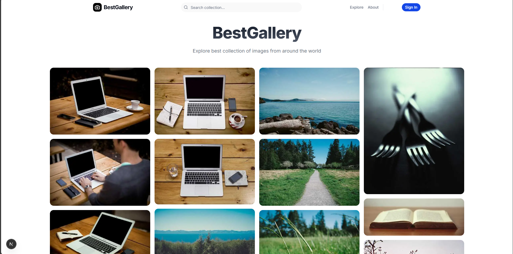

# BestGallery

BestGallery is a modern, responsive image gallery application built with Next.js 15 and Tailwind CSS. It features a stunning masonry grid layout, server-side data fetching, and a clean, glassmorphism-inspired user interface.



## Features

- **Masonry Grid Layout**: A beautiful, responsive grid that adapts to different screen sizes, handling images of varying aspect ratios gracefully.
- **Server Actions**: Efficient data fetching using Next.js Server Actions (`use server`) for better performance and security.
- **Server Components**: leveraged to reduce client-side bundle size and improve SEO.
- **Modern UI/UX**:
  - Glassmorphism Navbar with backdrop blur.
  - Smooth hover animations and transitions.
  - Interactive image overlays with action buttons.
- **Responsive Design**: Fully optimized for mobile, tablet, and desktop viewports.
- **Dynamic Content**: Fetches high-quality random images from the [Picsum Photos API](https://picsum.photos/).
- **About Page**: dedicated page sharing the platform's mission and story.

## Tech Stack

- **Framework**: [Next.js 15](https://nextjs.org/) (App Router)
- **Styling**: [Tailwind CSS v4](https://tailwindcss.com/)
- **Icons**: [Lucide React](https://lucide.dev/)
- **Language**: TypeScript
- **Font**: Geist Sans & Geist Mono

## Getting Started

First, install the dependencies:

```bash
npm install
# or
yarn install
# or
pnpm install
```

Then, run the development server:

```bash
npm run dev
# or
yarn dev
# or
pnpm dev
```

Open [http://localhost:3000](http://localhost:3000) with your browser to see the result.

## Project Structure

- `app/`: Next.js App Router pages and layouts.
  - `page.tsx`: The main homepage displaying the image grid.
  - `about/`: The About page directory.
  - `actions.ts`: Server actions for fetching data.
- `components/`: Reusable React components.
  - `ImageGrid.tsx`: The core masonry grid component (Server Component).
  - `Navbar.tsx`: Global navigation bar.
  - `Footer.tsx`: Application footer.
  - `GridSkeleton.tsx`: Loading state component.

## License

This project is open source and available under the [MIT License](LICENSE).
